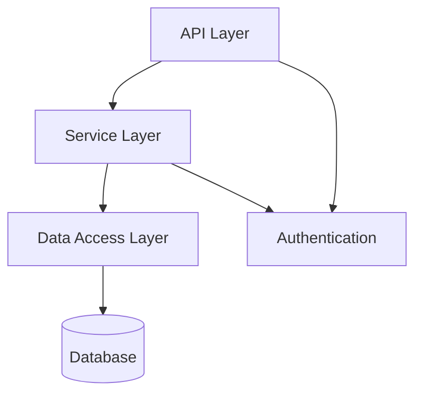
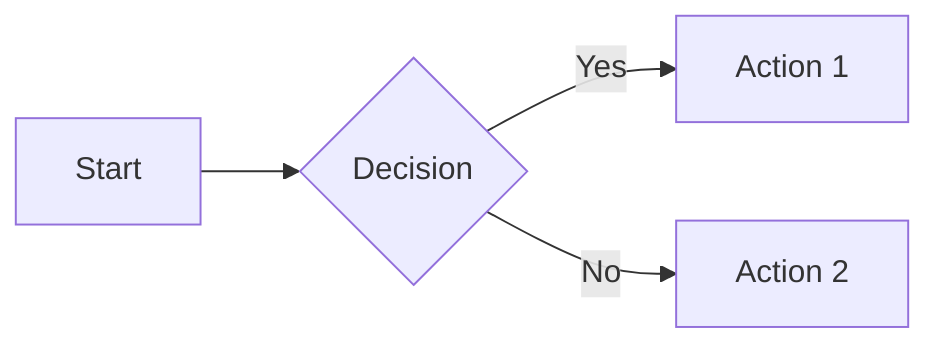

# MkDocs Ecosystem Research

**Status**: Complete
**Last Updated**: 2026-01-25
**Purpose**: Comprehensive research on MkDocs and its ecosystem for building living documentation systems

---

## Table of Contents

1. [MkDocs Core](#mkdocs-core)
2. [Essential Plugins](#essential-plugins)
3. [Theming Options](#theming-options)
4. [Real-World Configurations](#real-world-configurations)
5. [Living Documentation Strategies](#living-documentation-strategies)
6. [CI/CD Integration](#cicd-integration)
7. [Complete Plugin Catalog](#complete-plugin-catalog)
8. [Best Practices Summary](#best-practices-summary)

---

## MkDocs Core

### Latest Version & Features (2026)

**Key Updates:**
- `draft_docs` configuration option replaced `exclude_docs` for draft functionality
- Excluded Markdown pages are previewable in `mkdocs serve` with "DRAFT" marker
- New `--clean` flag for normal builds: `mkdocs serve --clean`
- Absolute links work correctly with `validation.links.absolute_links: relative_to_docs`
- Every plugin now has built-in `enabled` setting
- New command to guess Python dependencies: `mkdocs --print-site-packages`
- Improved server based on `http.server` and `watchdog` for more responsive reloads

### Configuration Best Practices

**Minimum Configuration:**
```yaml
site_name: My Project Documentation
```

**Recommended Configuration:**
```yaml
site_name: My Project
site_url: https://myproject.com  # Required for social cards and sitemaps
site_author: Your Name
site_description: A brief description for SEO
repo_url: https://github.com/username/project
repo_name: username/project

# Documentation structure
docs_dir: docs
site_dir: site

# Exclude patterns (MkDocs 1.5.0+)
exclude_docs: |
  *.py
  /drafts/
  *.tmp

# Validation
validation:
  links:
    absolute_links: relative_to_docs
```

**Important Notes:**
- `site_url` is required for features like social cards and sitemaps
- If `plugins` setting is defined, defaults are ignored and must be explicitly re-enabled
- Use `pathlib.Path` over `os.path` for file operations
- Default plugin is `search`, must be explicitly added if customizing plugins

---

## Essential Plugins

### 1. mkdocstrings - API Documentation

**Purpose**: Automatic documentation from Python source code docstrings

**Installation:**
```bash
pip install mkdocstrings[python]
```

**Configuration:**
```yaml
plugins:
  - search
  - mkdocstrings:
      handlers:
        python:
          paths: [src]
          options:
            # Docstring style
            docstring_style: google  # google, numpy, sphinx
            docstring_section_style: table

            # Cross-references
            signature_crossrefs: true
            separate_signature: true

            # Members
            members_order: source
            show_root_heading: true
            show_root_full_path: false
            show_symbol_type_heading: true
            show_symbol_type_toc: true

            # Filters
            filters:
              - "!^_"  # Exclude private members
            inherited_members: true

            # Source linking
            show_source: true

          import:
            - https://docs.python.org/3/objects.inv
            - https://docs.pydantic.dev/latest/objects.inv
```

**Features:**
- Recursive documentation from module dotted-path
- Type annotation support with automatic cross-references
- Multiple docstring styles (Google, NumPy, Sphinx)
- Cross-references across pages and external sites
- Uses Griffe for collecting object trees and docstrings

**Notable Users**: Ansible, Apache, FastAPI, Google, IBM, Microsoft, NVIDIA, Prefect, Pydantic, Textual

### 2. mkdocs-gen-files - Dynamic Page Generation

**Purpose**: Generate documentation pages programmatically during build

**Installation:**
```bash
pip install mkdocs-gen-files
```

**Configuration:**
```yaml
plugins:
  - search
  - gen-files:
      scripts:
        - scripts/gen_ref_pages.py
```

**Example Script** (`scripts/gen_ref_pages.py`):
```python
"""Generate the code reference pages."""

from pathlib import Path
import mkdocs_gen_files

nav = mkdocs_gen_files.Nav()

for path in sorted(Path("src").rglob("*.py")):
    module_path = path.relative_to("src").with_suffix("")
    doc_path = path.relative_to("src").with_suffix(".md")
    full_doc_path = Path("reference", doc_path)

    parts = tuple(module_path.parts)

    if parts[-1] == "__init__":
        parts = parts[:-1]
        doc_path = doc_path.with_name("index.md")
        full_doc_path = full_doc_path.with_name("index.md")
    elif parts[-1] == "__main__":
        continue

    nav[parts] = doc_path.as_posix()

    with mkdocs_gen_files.open(full_doc_path, "w") as fd:
        ident = ".".join(parts)
        fd.write(f"::: {ident}")

    mkdocs_gen_files.set_edit_path(full_doc_path, path)

with mkdocs_gen_files.open("reference/SUMMARY.md", "w") as nav_file:
    nav_file.writelines(nav.build_literate_nav())
```

**Use Cases:**
- Auto-generating API reference pages
- Creating navigation structures from code
- Generating indices and summary pages

### 3. mkdocs-literate-nav - Markdown Navigation

**Purpose**: Specify navigation in Markdown instead of YAML

**Installation:**
```bash
pip install mkdocs-literate-nav
```

**Configuration:**
```yaml
plugins:
  - search
  - literate-nav:
      nav_file: SUMMARY.md
      implicit_index: true
```

**Navigation Structure** (`docs/SUMMARY.md`):
```markdown
* [Home](index.md)
* [Getting Started](getting-started.md)
* [User Guide](user-guide/)
    * [Installation](user-guide/installation.md)
    * [Configuration](user-guide/configuration.md)
* [API Reference](reference/)
```

**Integration with gen-files:**
```yaml
nav:
  - Home: index.md
  - Code Reference: reference/  # Trailing slash looks for SUMMARY.md
```

### 4. mkdocs-autorefs - Cross-References

**Purpose**: Link to headings from any page without knowing paths

**Installation:**
```bash
pip install mkdocs-autorefs
```

**Configuration:**
```yaml
plugins:
  - search
  - autorefs
```

**Usage in Markdown:**
```markdown
See the [Installation] section for details.
Link to specific function: [my_function][package.module.my_function]
```

### 5. mkdocs-section-index - Clickable Sections

**Purpose**: Make navigation sections clickable to lead to index pages

**Installation:**
```bash
pip install mkdocs-section-index
```

**Configuration:**
```yaml
plugins:
  - search
  - section-index
```

**Navigation Example:**
```yaml
nav:
  - Home: index.md
  - User Guide:
      - user-guide/index.md
      - Installation: user-guide/installation.md
      - Configuration: user-guide/configuration.md
```

### 6. mkdocs-material - Premium Theme

**Installation:**
```bash
pip install mkdocs-material
```

**Major Update (November 2025)**: All Insiders features are now free for everyone. The project is entering maintenance mode with critical bug fixes for 12 months minimum.

**Basic Configuration:**
```yaml
theme:
  name: material
  favicon: img/favicon.ico

  palette:
    # Light mode
    - media: "(prefers-color-scheme: light)"
      scheme: default
      primary: teal
      accent: amber
      toggle:
        icon: material/brightness-7
        name: Switch to dark mode
    # Dark mode
    - media: "(prefers-color-scheme: dark)"
      scheme: slate
      primary: teal
      accent: amber
      toggle:
        icon: material/brightness-4
        name: Switch to light mode

  font:
    text: Roboto
    code: Roboto Mono

  icon:
    logo: material/library
    repo: fontawesome/brands/github

  features:
    # Navigation
    - navigation.instant
    - navigation.instant.prefetch
    - navigation.instant.preview
    - navigation.tracking
    - navigation.tabs
    - navigation.tabs.sticky
    - navigation.sections
    - navigation.expand
    - navigation.path
    - navigation.indexes
    - navigation.top

    # Table of contents
    - toc.follow
    - toc.integrate

    # Search
    - search.suggest
    - search.highlight
    - search.share

    # Header
    - header.autohide

    # Content
    - content.code.copy
    - content.code.annotate
    - content.tabs.link
    - content.tooltips
    - content.footnote.tooltips
```

**Notable Features:**
- 8,000+ icons and emojis
- Social card generation
- Blog support
- Search suggestions
- Code annotations
- Tabbed content
- Instant navigation
- Dark/light mode toggle

---

## Theming Options

### Material for MkDocs (Recommended)

**Strengths:**
- Most popular and actively maintained
- Beautiful default design
- Extensive built-in features
- Mobile-responsive
- 60+ language support
- All premium features now free (as of Nov 2025)

**Configuration Example:**
```yaml
theme:
  name: material
  custom_dir: docs/theme/overrides

extra_css:
  - stylesheets/extra.css

extra_javascript:
  - javascripts/extra.js
```

### Built-in Themes

**mkdocs (Default):**
- Custom Bootstrap theme
- Clean and simple
- Good for basic documentation

**readthedocs:**
- ReadTheDocs.org style
- Familiar to developers
- Classic documentation look

**Configuration:**
```yaml
theme:
  name: mkdocs  # or readthedocs
  color_mode: auto
  user_color_mode_toggle: true
  locale: en
```

### Third-Party Themes

**Cinder:**
- Built on Bootstrap 3
- Clean and responsive
- Pre-packaged highlight.js (185 languages)
- FontAwesome v5.12.0 icons
- Smashingly legible typography

**Installation:**
```bash
pip install mkdocs-cinder
```

**Bootswatch Themes:**
- 12 different Bootstrap themes
- Based on Bootswatch project

**Installation:**
```bash
pip install mkdocs-bootswatch
```

**More themes**: See [MkDocs Community Wiki](https://github.com/mkdocs/mkdocs/wiki/MkDocs-Themes)

---

## Real-World Configurations

### FastAPI Configuration

**Key Highlights:**
- Material theme with custom color palettes (teal/amber)
- Social cards with custom logo
- Macros for sponsors, contributors, translators
- Redirects for URL management
- 100+ documentation pages
- Multi-language support (12 languages)

**Complete Configuration:**
```yaml
site_name: FastAPI
site_description: FastAPI framework, high performance, easy to learn, fast to code, ready for production
site_url: https://fastapi.tiangolo.com/
repo_url: https://github.com/tiangolo/fastapi
repo_name: tiangolo/fastapi

theme:
  name: material
  palette:
    - media: "(prefers-color-scheme: light)"
      scheme: default
      primary: teal
      accent: amber
      toggle:
        icon: material/brightness-7
        name: Switch to dark mode
    - media: "(prefers-color-scheme: dark)"
      scheme: slate
      primary: teal
      accent: amber
      toggle:
        icon: material/brightness-4
        name: Switch to light mode

  features:
    - content.code.annotate
    - content.code.copy
    - content.tooltips
    - navigation.footer
    - navigation.indexes
    - navigation.instant
    - navigation.instant.prefetch
    - navigation.path
    - navigation.tabs
    - navigation.tabs.sticky
    - navigation.top
    - search.highlight
    - search.suggest
    - toc.follow

plugins:
  - search
  - social:
      cards_layout_options:
        logo: docs/img/logo.png
  - macros:
      include_yaml:
        - data/sponsors.yml
        - data/contributors.yml
        - data/translators.yml
  - redirects:
      redirect_maps:
        # Old URL: new URL mappings
  - mkdocstrings:
      handlers:
        python:
          options:
            show_root_heading: true
            show_root_full_path: false
            separate_signature: true
            signature_crossrefs: true
            merge_init_into_class: true

markdown_extensions:
  - toc:
      permalink: true
  - markdown.extensions.codehilite:
      guess_lang: false
  - admonition
  - codehilite
  - extra
  - pymdownx.superfences:
      custom_fences:
        - name: mermaid
          class: mermaid
          format: !!python/name:pymdownx.superfences.fence_code_format
  - pymdownx.tabbed:
      alternate_style: true
  - pymdownx.highlight:
      anchor_linenums: true
  - pymdownx.inlinehilite
  - pymdownx.snippets
```

### Pydantic Configuration

**Key Highlights:**
- Material theme with pink accent
- Mike for version management
- Algolia search integration
- Griffe-pydantic extension
- Google Analytics and feedback widget
- Watch on pydantic source directory

**Complete Configuration:**
```yaml
site_name: Pydantic
site_description: Data validation using Python type hints
site_url: https://docs.pydantic.dev/
repo_url: https://github.com/pydantic/pydantic
repo_name: pydantic/pydantic

theme:
  name: material
  custom_dir: docs/theme

  palette:
    - media: "(prefers-color-scheme)"
      toggle:
        icon: material/brightness-auto
        name: Switch to light mode
    - media: "(prefers-color-scheme: light)"
      scheme: default
      primary: pink
      accent: pink
      toggle:
        icon: material/brightness-7
        name: Switch to dark mode
    - media: "(prefers-color-scheme: dark)"
      scheme: slate
      primary: pink
      accent: pink
      toggle:
        icon: material/brightness-4
        name: Switch to light mode

  features:
    - content.code.annotate
    - content.code.copy
    - content.tabs.link
    - navigation.footer
    - navigation.instant
    - navigation.instant.prefetch
    - navigation.path
    - navigation.tabs
    - navigation.tabs.sticky
    - navigation.top
    - search.suggest
    - toc.follow

plugins:
  - search
  - mkdocstrings:
      handlers:
        python:
          paths: [src]
          options:
            members_order: source
            separate_signature: true
            filters: ["!^_"]
            docstring_options:
              ignore_init_summary: true
            merge_init_into_class: true
            extensions:
              - griffe_pydantic
          import:
            - https://docs.python.org/3/objects.inv
  - mike:
      alias_type: symlink
      canonical_version: latest
  - autorefs

watch:
  - pydantic

markdown_extensions:
  - tables
  - admonition
  - pymdownx.details
  - pymdownx.superfences
  - pymdownx.highlight:
      anchor_linenums: true
  - pymdownx.inlinehilite
  - pymdownx.snippets
  - pymdownx.tabbed:
      alternate_style: true
  - pymdownx.emoji:
      emoji_index: !!python/name:material.extensions.emoji.twemoji
      emoji_generator: !!python/name:material.extensions.emoji.to_svg
  - attr_list
  - md_in_html

extra:
  analytics:
    provider: google
    property: G-XXXXXXXXXX
    feedback:
      title: Was this page helpful?
      ratings:
        - icon: material/thumb-up-outline
          name: This page was helpful
          data: 1
          note: Thanks for your feedback!
        - icon: material/thumb-down-outline
          name: This page could be improved
          data: 0
          note: Thanks for your feedback!
```

### MkDocs Project Configuration

**Key Highlights:**
- Uses its own built-in theme
- Auto-references and literate-nav
- Redirects for URL management
- Minimal but complete setup

**Configuration:**
```yaml
site_name: MkDocs
site_url: https://www.mkdocs.org/
site_description: Project documentation with Markdown.
repo_url: https://github.com/mkdocs/mkdocs/
repo_name: mkdocs/mkdocs

theme:
  name: mkdocs
  color_mode: auto
  user_color_mode_toggle: true
  locale: en
  analytics:
    gtag: G-274394082
  highlightjs: true
  hljs_languages:
    - yaml
    - django

plugins:
  - search
  - redirects
  - autorefs
  - literate-nav:
      nav_file: SUMMARY.md
  - mkdocstrings:
      handlers:
        python:
          paths: [.]
          options:
            show_root_heading: true

markdown_extensions:
  - toc:
      permalink: true
  - attr_list
  - def_list
  - pymdownx.highlight
  - pymdownx.snippets:
      base_path: !relative $config_dir

extra_css:
  - css/extra.css

exclude_docs: |
  *.py

watch:
  - mkdocs

nav:
  - Home: index.md
  - Getting Started: getting-started.md
  - User Guide:
      - Writing Your Docs: user-guide/writing-your-docs.md
      - Configuration: user-guide/configuration.md
      - Deploying: user-guide/deploying-your-docs.md
  - Developer Guide:
      - API: dev-guide/api.md
      - Plugins: dev-guide/plugins.md
      - Themes: dev-guide/themes.md
  - About:
      - Release Notes: about/release-notes.md
      - Contributing: about/contributing.md
      - License: about/license.md
```

---

## Living Documentation Strategies

### Strategy 1: Full Auto-Generation with Three Plugins

**Recommended Plugin Combination:**
```yaml
plugins:
  - search
  - gen-files:
      scripts:
        - scripts/gen_ref_pages.py
  - literate-nav:
      nav_file: SUMMARY.md
  - section-index
  - mkdocstrings:
      handlers:
        python:
          paths: [src]
```

**Benefits:**
- Zero maintenance for API docs
- Navigation auto-generated from code structure
- Clickable section indices
- Cross-references work automatically

**Recipe Steps:**

1. **Generate Pages On-the-Fly**: Use `gen-files` to create Markdown pages dynamically
2. **Generate Literate Navigation**: Auto-generate navigation structure
3. **Bind Pages to Sections**: Use `section-index` for `__init__` modules

### Strategy 2: Hybrid Manual + Auto Documentation

**Structure:**
```
docs/
├── index.md                    # Manual: Landing page
├── getting-started/
│   ├── index.md               # Manual: Getting started guide
│   ├── installation.md        # Manual: Installation instructions
│   └── quickstart.md          # Manual: Quick start tutorial
├── guides/
│   ├── index.md               # Manual: Guides overview
│   ├── architecture.md        # Manual: Living architecture doc
│   └── best-practices.md      # Manual: Best practices
└── reference/                 # Auto-generated: API reference
    ├── SUMMARY.md             # Auto-generated: Navigation
    └── ...                    # Auto-generated: Module docs
```

**Configuration:**
```yaml
nav:
  - Home: index.md
  - Getting Started:
      - getting-started/index.md
      - Installation: getting-started/installation.md
      - Quickstart: getting-started/quickstart.md
  - Guides:
      - guides/index.md
      - Architecture: guides/architecture.md
      - Best Practices: guides/best-practices.md
  - API Reference: reference/  # Literate nav takes over
```

### Strategy 3: Architecture Documentation as Living Doc

**Key Principles:**
1. Architecture docs live in `docs/architecture/` or `docs/guides/architecture.md`
2. Update architecture docs when code changes
3. Use Mermaid diagrams for visualization
4. Link to API reference automatically

**Example Architecture Page:**
```markdown
# System Architecture

## Overview
This document describes the current system architecture.

## Component Diagram



## Core Components

### API Layer
The API layer is implemented in [`api.core`][api.core] and handles HTTP requests.

### Service Layer
Business logic is in [`services`][services] module.

## Design Decisions

See [ADR-001](../adr/001-use-fastapi.md) for API framework choice.
```

### Strategy 4: Keeping Docs in Sync

**Pre-commit Hook:**
```yaml
# .pre-commit-config.yaml
repos:
  - repo: https://github.com/DavidAnson/markdownlint-cli2
    rev: v0.13.0
    hooks:
      - id: markdownlint-cli2

  - repo: local
    hooks:
      - id: mkdocs-build
        name: Build MkDocs
        entry: mkdocs build --strict
        language: system
        pass_filenames: false
        always_run: true
```

**GitHub Actions:**
```yaml
name: Documentation

on:
  push:
    branches: [main]
  pull_request:
    branches: [main]

jobs:
  build:
    runs-on: ubuntu-latest
    steps:
      - uses: actions/checkout@v4

      - uses: actions/setup-python@v5
        with:
          python-version: '3.12'

      - name: Install dependencies
        run: |
          pip install -r docs/requirements.txt

      - name: Build documentation
        run: mkdocs build --strict

      - name: Deploy to GitHub Pages
        if: github.ref == 'refs/heads/main'
        run: mkdocs gh-deploy --force
```

**Watch Source Code:**
```yaml
# mkdocs.yml
watch:
  - src/myproject
  - CHANGELOG.md
  - README.md
```

---

## CI/CD Integration

### GitHub Actions Deployment

**Complete Workflow** (`.github/workflows/docs.yml`):
```yaml
name: Deploy Documentation

on:
  push:
    branches:
      - main
      - master
  pull_request:
    branches:
      - main
      - master

permissions:
  contents: write

jobs:
  deploy:
    runs-on: ubuntu-latest

    steps:
      - name: Checkout repository
        uses: actions/checkout@v4
        with:
          fetch-depth: 0  # Fetch all history for git-revision-date-localized

      - name: Setup Python
        uses: actions/setup-python@v5
        with:
          python-version: 3.x

      - name: Cache dependencies
        uses: actions/cache@v4
        with:
          key: ${{ github.ref }}
          path: .cache

      - name: Install dependencies
        run: |
          pip install mkdocs-material
          pip install mkdocstrings[python]
          pip install mkdocs-gen-files
          pip install mkdocs-literate-nav
          pip install mkdocs-section-index
          pip install mkdocs-autorefs
          pip install mkdocs-git-revision-date-localized-plugin
          pip install mkdocs-minify-plugin
          # Or use: pip install -r docs/requirements.txt

      - name: Build documentation
        run: mkdocs build --strict

      - name: Deploy to GitHub Pages
        if: github.event_name == 'push' && github.ref == 'refs/heads/main'
        run: mkdocs gh-deploy --force
```

### Requirements File Approach

**docs/requirements.txt:**
```txt
mkdocs>=1.5.0
mkdocs-material>=9.5.0
mkdocstrings[python]>=0.24.0
mkdocs-gen-files>=0.5.0
mkdocs-literate-nav>=0.6.0
mkdocs-section-index>=0.3.0
mkdocs-autorefs>=0.5.0
mkdocs-git-revision-date-localized-plugin>=1.2.0
mkdocs-minify-plugin>=0.8.0
pillow>=10.0.0  # For social cards
cairosvg>=2.7.0  # For social cards
```

**Simplified Workflow:**
```yaml
- name: Install dependencies
  run: pip install -r docs/requirements.txt
```

### Pre-commit Integration

**.pre-commit-config.yaml:**
```yaml
repos:
  # Markdown linting
  - repo: https://github.com/DavidAnson/markdownlint-cli2
    rev: v0.13.0
    hooks:
      - id: markdownlint-cli2
        args: ["--config", ".markdownlint.yaml"]

  # YAML linting
  - repo: https://github.com/pre-commit/pre-commit-hooks
    rev: v4.5.0
    hooks:
      - id: check-yaml
        args: [--safe]
      - id: end-of-file-fixer
      - id: trailing-whitespace

  # MkDocs validation
  - repo: local
    hooks:
      - id: mkdocs-build
        name: Build MkDocs documentation
        entry: mkdocs build --strict --verbose
        language: system
        pass_filenames: false
        files: ^(docs/|mkdocs\.yml)
```

### Build Validation

**Strict Mode:**
```bash
mkdocs build --strict
```
- Treats warnings as errors
- Fails build on broken links
- Validates all cross-references

**Verbose Mode:**
```bash
mkdocs build --strict --verbose
```
- Shows detailed build information
- Helps debug issues

---

## Complete Plugin Catalog

### Documentation Generation

| Plugin | Purpose | Installation |
|--------|---------|--------------|
| **mkdocstrings** | Auto-generate API docs from docstrings | `pip install mkdocstrings[python]` |
| **mkdocs-gen-files** | Generate pages programmatically | `pip install mkdocs-gen-files` |
| **mkdocs-autorefs** | Cross-reference automation | `pip install mkdocs-autorefs` |

### Navigation & Structure

| Plugin | Purpose | Installation |
|--------|---------|--------------|
| **mkdocs-literate-nav** | Markdown-based navigation | `pip install mkdocs-literate-nav` |
| **mkdocs-section-index** | Clickable section headers | `pip install mkdocs-section-index` |
| **mkdocs-awesome-pages** | Simplified page ordering via `.pages` files | `pip install mkdocs-awesome-pages-plugin` |

### Content Enhancement

| Plugin | Purpose | Installation |
|--------|---------|--------------|
| **mkdocs-macros** | Variables and Jinja2 templates | `pip install mkdocs-macros-plugin` |
| **mkdocs-include-markdown** | Include/reuse Markdown content | `pip install mkdocs-include-markdown-plugin` |
| **mkdocs-jupyter** | Embed Jupyter notebooks | `pip install mkdocs-jupyter` |
| **mkdocs-mermaid2** | Mermaid diagram support | `pip install mkdocs-mermaid2-plugin` |

### Versioning & History

| Plugin | Purpose | Installation |
|--------|---------|--------------|
| **mike** | Multi-version documentation via Git | `pip install mike` |
| **mkdocs-git-revision-date-localized** | Show last update dates | `pip install mkdocs-git-revision-date-localized-plugin` |

### Publishing & Distribution

| Plugin | Purpose | Installation |
|--------|---------|--------------|
| **mkdocs-material[social]** | Social card generation | `pip install mkdocs-material` |
| **mkdocs-rss** | RSS feed generation | `pip install mkdocs-rss-plugin` |
| **mkdocs-newsletter** | Newsletter from git changes | `pip install mkdocs-newsletter` |
| **mkdocs-privacy** | GDPR compliance (self-host assets) | Built into Material |

### Organization & Metadata

| Plugin | Purpose | Installation |
|--------|---------|--------------|
| **tags** | Categorize pages with tags | Built into Material |
| **meta** | Section-wide metadata via `.meta.yml` | Built into Material |
| **redirects** | URL redirect management | `pip install mkdocs-redirects` |

### Export & Optimization

| Plugin | Purpose | Installation |
|--------|---------|--------------|
| **mkdocs-with-pdf** | Generate PDF from docs | `pip install mkdocs-with-pdf` |
| **mkdocs-exporter** | Fast PDF export with browser | `pip install mkdocs-exporter` |
| **mkdocs-minify** | Minify HTML/CSS/JS | `pip install mkdocs-minify-plugin` |

### CLI & Special Tools

| Plugin | Purpose | Installation |
|--------|---------|--------------|
| **mkdocs-typer** | Typer CLI documentation | `pip install mkdocs-typer` |
| **mkdocs-typer2** | Modern Typer CLI docs | `pip install mkdocs-typer2` |

### Multi-Project

| Plugin | Purpose | Installation |
|--------|---------|--------------|
| **mkdocs-monorepo** | Multiple docs in monorepo | `pip install mkdocs-monorepo-plugin` |
| **mkdocs-multirepo** | Docs from multiple repos | `pip install mkdocs-multirepo-plugin` |

### Hooks & Automation

| Plugin | Purpose | Installation |
|--------|---------|--------------|
| **hooks** | Custom Python scripts (MkDocs 1.4+) | Built-in |
| **mkdocs-simple-hooks** | Legacy hooks (deprecated) | `pip install mkdocs-simple-hooks` |

---

## Markdown Extensions (PyMdown)

### Essential Extensions

```yaml
markdown_extensions:
  # Basic Markdown
  - toc:
      permalink: true
      toc_depth: 3
  - tables
  - attr_list
  - def_list
  - md_in_html
  - abbr
  - footnotes

  # Admonitions
  - admonition
  - pymdownx.details

  # Code blocks
  - pymdownx.highlight:
      anchor_linenums: true
      line_spans: __span
      pygments_lang_class: true
  - pymdownx.inlinehilite
  - pymdownx.snippets:
      base_path: !relative $config_dir
      check_paths: true
  - pymdownx.superfences:
      custom_fences:
        - name: mermaid
          class: mermaid
          format: !!python/name:pymdownx.superfences.fence_code_format

  # Content tabs
  - pymdownx.tabbed:
      alternate_style: true
      combine_header_slug: true

  # Task lists
  - pymdownx.tasklist:
      custom_checkbox: true

  # Icons and emojis
  - pymdownx.emoji:
      emoji_index: !!python/name:material.extensions.emoji.twemoji
      emoji_generator: !!python/name:material.extensions.emoji.to_svg

  # Formatting
  - pymdownx.critic
  - pymdownx.caret
  - pymdownx.keys
  - pymdownx.mark
  - pymdownx.tilde

  # Math
  - pymdownx.arithmatex:
      generic: true
```

### Extension Highlights

**SuperFences:**
- Arbitrary nesting of code and content blocks
- Custom fences for Mermaid, Rich, Textual
- Syntax highlighting with Pygments

**Tabbed:**
- Content tabs for organizing related content
- Alternate styling option
- Great for multi-language examples

**Admonitions:**
- Note, warning, tip, danger, etc.
- Collapsible with `pymdownx.details`
- Custom icons and styling

**Snippets:**
- Include external file content
- Embed code from source files
- Syntax: `--8<-- "path/to/file.py"`

---

## Best Practices Summary

### 1. Documentation Structure

**Recommended Layout:**
```
project/
├── mkdocs.yml
├── docs/
│   ├── index.md
│   ├── getting-started/
│   │   ├── index.md
│   │   ├── installation.md
│   │   └── quickstart.md
│   ├── guides/
│   │   ├── index.md
│   │   ├── architecture.md
│   │   └── contributing.md
│   ├── tutorials/
│   ├── how-to/
│   ├── reference/          # Auto-generated
│   │   └── SUMMARY.md      # Auto-generated
│   ├── changelog.md
│   └── assets/
│       ├── images/
│       ├── diagrams/
│       └── stylesheets/
├── scripts/
│   ├── gen_ref_pages.py
│   └── validate_docs.py
├── .github/
│   └── workflows/
│       └── docs.yml
└── src/
    └── myproject/
```

### 2. Documentation Philosophy

**Diátaxis Framework** (Used by Pydantic, FastAPI):
- **Tutorials**: Learning-oriented, step-by-step guides
- **How-to Guides**: Problem-oriented, practical steps
- **Reference**: Information-oriented, technical descriptions
- **Explanation**: Understanding-oriented, clarification

### 3. Quality Standards

**Manual Documentation:**
- Focus on "why" not "what"
- Include examples and use cases
- Link to API reference automatically
- Update when features change

**Auto-Generated Documentation:**
- Write comprehensive docstrings
- Use type hints consistently
- Follow docstring style guide (Google, NumPy, Sphinx)
- Include examples in docstrings

### 4. SEO & Discoverability

**Required Settings:**
```yaml
site_url: https://yourdomain.com
site_description: Clear description for search engines

plugins:
  - search  # Generates sitemap.xml automatically

extra:
  social:
    - icon: fontawesome/brands/github
      link: https://github.com/username/project
    - icon: fontawesome/brands/twitter
      link: https://twitter.com/username
```

**Meta Tags in Pages:**
```markdown
---
description: Page-specific description for SEO
---

# Page Title
```

### 5. Performance Optimization

```yaml
plugins:
  - search
  - minify:
      minify_html: true
      minify_js: true
      minify_css: true
      htmlmin_opts:
        remove_comments: true
      cache_safe: true
  - privacy:  # Self-host external assets for GDPR
      enabled: !ENV [CI, false]
```

### 6. Developer Experience

**Local Development:**
```bash
# Serve with live reload
mkdocs serve

# Serve on different port
mkdocs serve -a localhost:8001

# Clean build (no drafts)
mkdocs serve --clean

# Build only (no serve)
mkdocs build

# Strict mode (fail on warnings)
mkdocs build --strict
```

**Watching Files:**
```yaml
watch:
  - src/
  - README.md
  - CHANGELOG.md
  - CONTRIBUTING.md
```

---

## Advanced Features

### Social Cards

**Configuration:**
```yaml
plugins:
  - social:
      cards: true
      cards_layout_options:
        background_color: "#0FF1CE"
        logo: docs/assets/logo.png
        font_family: Roboto

extra:
  social:
    - icon: fontawesome/brands/github
      link: https://github.com/username
```

**Custom Layout:**
```markdown
---
social:
  cards_layout: custom
  cards_layout_options:
    background_color: blue
---
```

### Code Annotations

**Configuration:**
```yaml
theme:
  features:
    - content.code.annotate

markdown_extensions:
  - pymdownx.highlight
  - pymdownx.superfences
```

**Usage:**
```python
def example():
    value = "hello"  # (1)
    return value
```

```markdown
1. This is an annotation with **formatting**, [links](url), and more!
```

### Mermaid Diagrams

**Configuration:**
```yaml
markdown_extensions:
  - pymdownx.superfences:
      custom_fences:
        - name: mermaid
          class: mermaid
          format: !!python/name:pymdownx.superfences.fence_code_format
```

**Usage:**
````markdown

````

**Supported Diagram Types:**
- Flowcharts
- Sequence diagrams
- Class diagrams
- State diagrams
- Entity-relationship diagrams
- Gantt charts
- Pie charts
- Git graphs

### Tags & Categorization

**Configuration:**
```yaml
plugins:
  - tags:
      tags_file: tags.md  # Optional tags index page

  - meta  # For section-wide tags
```

**Page Tags:**
```markdown
---
tags:
  - API
  - Advanced
  - Python
---
```

**Section Tags** (`.meta.yml` in directory):
```yaml
tags:
  - Tutorial
  - Getting Started
```

### Blog Integration

**Configuration:**
```yaml
plugins:
  - blog:
      blog_dir: blog
      blog_toc: true
      post_date_format: full
      post_url_format: "{date}/{slug}"
      authors_file: .authors.yml
```

**Authors File** (`.authors.yml`):
```yaml
authors:
  johndoe:
    name: John Doe
    description: Lead Developer
    avatar: https://github.com/johndoe.png
    url: https://github.com/johndoe
```

### Version Management with Mike

**Setup:**
```bash
# Deploy version
mike deploy 1.0 latest --update-aliases

# Set default version
mike set-default latest

# List versions
mike list

# Delete version
mike delete 0.9
```

**Configuration:**
```yaml
plugins:
  - mike:
      alias_type: symlink
      canonical_version: latest

extra:
  version:
    provider: mike
```

### Custom Hooks

**docs/hooks.py:**
```python
"""Custom build hooks for MkDocs."""

import logging
from pathlib import Path

log = logging.getLogger("mkdocs.hooks")

def on_pre_build(config):
    """Run before build starts."""
    log.info("Running pre-build tasks...")
    # Copy README.md to docs/
    readme = Path("README.md")
    if readme.exists():
        dest = Path(config["docs_dir"]) / "index.md"
        dest.write_text(readme.read_text())

def on_page_markdown(markdown, page, config, files):
    """Process markdown before conversion."""
    # Add custom processing
    return markdown

def on_post_build(config):
    """Run after build completes."""
    log.info("Post-build tasks complete")
```

**Configuration:**
```yaml
hooks:
  - docs/hooks.py
```

---

## Complete Working Example

### Minimal Production Setup

**mkdocs.yml:**
```yaml
site_name: My Project
site_url: https://myproject.com
site_description: A modern Python project
repo_url: https://github.com/username/myproject
repo_name: username/myproject

theme:
  name: material
  palette:
    - scheme: default
      primary: indigo
      accent: indigo
      toggle:
        icon: material/brightness-7
        name: Switch to dark mode
    - scheme: slate
      primary: indigo
      accent: indigo
      toggle:
        icon: material/brightness-4
        name: Switch to light mode

  features:
    - navigation.instant
    - navigation.tracking
    - navigation.tabs
    - navigation.tabs.sticky
    - navigation.sections
    - navigation.expand
    - navigation.indexes
    - navigation.top
    - search.suggest
    - search.highlight
    - content.code.copy
    - content.code.annotate

plugins:
  - search
  - autorefs
  - gen-files:
      scripts:
        - scripts/gen_ref_pages.py
  - literate-nav:
      nav_file: SUMMARY.md
  - section-index
  - mkdocstrings:
      handlers:
        python:
          paths: [src]
          options:
            docstring_style: google
            show_root_heading: true
            show_source: true
            members_order: source
            filters: ["!^_"]
            signature_crossrefs: true
          import:
            - https://docs.python.org/3/objects.inv
  - git-revision-date-localized:
      enable_creation_date: true
      type: timeago
  - minify:
      minify_html: true

markdown_extensions:
  - toc:
      permalink: true
  - admonition
  - pymdownx.details
  - pymdownx.superfences:
      custom_fences:
        - name: mermaid
          class: mermaid
          format: !!python/name:pymdownx.superfences.fence_code_format
  - pymdownx.tabbed:
      alternate_style: true
  - pymdownx.highlight:
      anchor_linenums: true
  - pymdownx.inlinehilite
  - pymdownx.snippets
  - pymdownx.emoji:
      emoji_index: !!python/name:material.extensions.emoji.twemoji
      emoji_generator: !!python/name:material.extensions.emoji.to_svg
  - attr_list
  - md_in_html

watch:
  - src/

nav:
  - Home: index.md
  - Getting Started:
      - getting-started/index.md
      - Installation: getting-started/installation.md
      - Quickstart: getting-started/quickstart.md
  - User Guide:
      - user-guide/index.md
  - API Reference: reference/
  - Changelog: changelog.md

extra:
  social:
    - icon: fontawesome/brands/github
      link: https://github.com/username/myproject
  version:
    provider: mike
```

### Generation Script

**scripts/gen_ref_pages.py:**
```python
"""Generate the code reference pages and navigation."""

from pathlib import Path
import mkdocs_gen_files

nav = mkdocs_gen_files.Nav()
mod_symbol = '<code class="doc-symbol doc-symbol-nav doc-symbol-module"></code>'

root = Path(__file__).parent.parent
src = root / "src"

for path in sorted(src.rglob("*.py")):
    module_path = path.relative_to(src).with_suffix("")
    doc_path = path.relative_to(src).with_suffix(".md")
    full_doc_path = Path("reference", doc_path)

    parts = tuple(module_path.parts)

    if parts[-1] == "__init__":
        parts = parts[:-1]
        doc_path = doc_path.with_name("index.md")
        full_doc_path = full_doc_path.with_name("index.md")
    elif parts[-1].startswith("_"):
        continue

    if parts:
        nav[parts] = doc_path.as_posix()

        with mkdocs_gen_files.open(full_doc_path, "w") as fd:
            ident = ".".join(parts)
            fd.write(f"# {ident}\n\n::: {ident}")

        mkdocs_gen_files.set_edit_path(full_doc_path, path.relative_to(root))

with mkdocs_gen_files.open("reference/SUMMARY.md", "w") as nav_file:
    nav_file.writelines(nav.build_literate_nav())
```

### GitHub Actions

**.github/workflows/docs.yml:**
```yaml
name: Documentation

on:
  push:
    branches: [main]
  pull_request:

permissions:
  contents: write

jobs:
  deploy:
    runs-on: ubuntu-latest
    steps:
      - uses: actions/checkout@v4
        with:
          fetch-depth: 0

      - uses: actions/setup-python@v5
        with:
          python-version: 3.x

      - run: pip install -r docs/requirements.txt

      - run: mkdocs build --strict

      - if: github.event_name == 'push' && github.ref == 'refs/heads/main'
        run: mkdocs gh-deploy --force
```

---

## Typer CLI Documentation

### mkdocs-typer2 (Modern Approach)

**Configuration:**
```yaml
plugins:
  - search
  - mkdocs-typer2:
      pretty: true  # Use tables instead of lists
```

**Usage:**
```markdown
# CLI Reference

::: mkdocs-typer2
    :module: myproject.cli
    :command: main
    :prog_name: myproject
```

**Features:**
- Uses Typer's built-in `typer utils docs` command
- Pretty formatting with tables
- Automatic option/argument documentation
- Subcommand support

---

## Jupyter Notebook Integration

### mkdocs-jupyter

**Configuration:**
```yaml
plugins:
  - search
  - mkdocs-jupyter:
      include_source: true
      execute: false
      allow_errors: false
      kernel_name: python3
      remove_tag_config:
        remove_input_tags:
          - hide_input
```

**Navigation:**
```yaml
nav:
  - Home: index.md
  - Tutorials:
      - Example: tutorials/example.ipynb
      - Analysis: tutorials/analysis.ipynb
```

**Best Practices:**
- First H1 header (`#`) becomes page title
- Use H2 headers (`##`) for table of contents
- Tag cells with `hide_input` to hide code
- Include source for downloadable notebooks

---

## GDPR Compliance & Privacy

### Privacy Plugin

**Configuration:**
```yaml
plugins:
  - privacy:
      enabled: !ENV [CI, false]
      assets: true
      assets_fetch: true
      assets_fetch_dir: assets/external
      cache: true
      cache_dir: .cache/plugins/privacy
```

**What It Does:**
- Scans HTML for external assets (scripts, stylesheets, images, fonts)
- Downloads and self-hosts all external resources
- Replaces URLs with local copies
- Ensures GDPR compliance by preventing data leaks

**Benefits:**
- No external requests to third-party servers
- No IP address leakage
- Faster page loads (cached locally)
- Offline-friendly documentation

---

## Advanced Patterns

### Pattern 1: Monorepo Documentation

**Structure:**
```
monorepo/
├── mkdocs.yml              # Root config
├── docs/
│   └── index.md           # Landing page
├── project-a/
│   ├── mkdocs.yml         # Project A config
│   └── docs/
│       └── index.md
└── project-b/
    ├── mkdocs.yml         # Project B config
    └── docs/
        └── index.md
```

**Root mkdocs.yml:**
```yaml
site_name: My Organization
theme:
  name: material

plugins:
  - search
  - monorepo:
      enabled: !ENV [MONOREPO, true]

nav:
  - Home: index.md
  - Project A: '!include ./project-a/mkdocs.yml'
  - Project B: '!include ./project-b/mkdocs.yml'
```

### Pattern 2: Multi-Language Documentation

**Structure:**
```
docs/
├── en/
│   └── mkdocs.yml
├── es/
│   └── mkdocs.yml
└── fr/
    └── mkdocs.yml
```

**Language-Specific Config:**
```yaml
site_name: My Project
site_url: https://myproject.com/en/

theme:
  name: material
  language: en

extra:
  alternate:
    - name: English
      link: /en/
      lang: en
    - name: Español
      link: /es/
      lang: es
    - name: Français
      link: /fr/
      lang: fr
```

### Pattern 3: Include External Files

**Using snippets:**
```markdown
# Installation

--8<-- "README.md:installation"

# Configuration

--8<-- "examples/config.yml"
```

**Using include-markdown:**
```markdown
# API Overview


```

### Pattern 4: Macros & Variables

**Configuration:**
```yaml
plugins:
  - macros:
      module_name: docs/macros
      include_yaml:
        - data/config.yml
        - data/team.yml

extra:
  version: 1.0.0
  company: Acme Corp
```

**Usage in Markdown:**
```markdown
# Welcome to {{ config.extra.company }}

Current version: {{ config.extra.version }}


- {{ member.name }} - {{ member.role }}

```

**Custom Macros** (`docs/macros.py`):
```python
def define_env(env):
    """Define custom macros and variables."""

    @env.macro
    def get_latest_release():
        # Fetch from GitHub API
        return "1.0.0"

    env.variables['project_name'] = 'My Project'
```

---

## Troubleshooting & Tips

### Common Issues

**1. Plugins Not Working:**
```yaml
# BAD - search plugin disabled
plugins:
  - mkdocstrings

# GOOD - explicitly enable search
plugins:
  - search
  - mkdocstrings
```

**2. Cross-References Broken:**
- Ensure `autorefs` plugin is loaded
- Check import URLs in mkdocstrings config
- Use full module paths in references

**3. Build Failures:**
```bash
# Use strict mode to catch issues
mkdocs build --strict --verbose

# Check specific warnings
mkdocs build 2>&1 | grep WARNING
```

**4. Slow Builds:**
- Disable social cards in development
- Use `enabled: !ENV [CI, false]` for expensive plugins
- Cache dependencies in CI/CD

**5. Navigation Issues:**
- Check plugin order (awesome-pages after versioning)
- Verify SUMMARY.md is generated correctly
- Use `nav_file` parameter in literate-nav

### Performance Tips

**Development:**
```yaml
plugins:
  - search
  - social:
      enabled: !ENV [CI, false]  # Only in CI
  - minify:
      enabled: !ENV [CI, false]  # Only in CI
  - privacy:
      enabled: !ENV [CI, false]  # Only in CI
```

**Production:**
```bash
export CI=true
mkdocs build --strict
```

### Plugin Order Matters

**Correct Order:**
```yaml
plugins:
  - search              # Always first
  - awesome-pages       # Before navigation generation
  - gen-files           # Generate files
  - literate-nav        # Process navigation
  - section-index       # After navigation
  - mkdocstrings        # Process autodoc
  - autorefs            # After mkdocstrings
  - git-revision-date-localized  # Metadata
  - minify              # Last (post-processing)
```

---

## Migration Guides

### From Sphinx to MkDocs

**Key Differences:**
- MkDocs uses Markdown vs. Sphinx's reStructuredText
- Simpler configuration (YAML vs. conf.py)
- Different plugin ecosystem
- Cross-references work differently

**Migration Steps:**
1. Convert `.rst` files to `.md` (use pandoc)
2. Create `mkdocs.yml` based on `conf.py`
3. Replace autodoc with mkdocstrings
4. Update cross-reference syntax
5. Migrate custom extensions to MkDocs plugins

### From Manual Docs to Auto-Generated

**Phase 1: Setup Auto-Generation**
```yaml
plugins:
  - search
  - gen-files:
      scripts:
        - scripts/gen_ref_pages.py
  - literate-nav
  - mkdocstrings
```

**Phase 2: Improve Docstrings**
- Add comprehensive docstrings to all public APIs
- Use type hints consistently
- Include examples in docstrings
- Follow chosen docstring style (Google/NumPy/Sphinx)

**Phase 3: Restructure Manual Docs**
- Move tutorials to separate section
- Create how-to guides
- Link manual docs to auto-generated reference
- Remove duplicated API documentation

---

## Key Takeaways

### For Living Documentation Systems

1. **Combine Auto + Manual**: Auto-generate API reference, manually write guides/tutorials
2. **Use Git Metadata**: Show last update dates automatically
3. **Watch Source Code**: Rebuild when code changes
4. **Validate in CI**: Use `--strict` mode in pipelines
5. **Version Your Docs**: Use Mike for version management

### Essential Plugin Stack

**Minimum Viable:**
- search
- mkdocstrings
- autorefs

**Recommended:**
- search
- gen-files
- literate-nav
- section-index
- mkdocstrings
- autorefs
- git-revision-date-localized

**Full-Featured:**
- All recommended plugins +
- mike (versioning)
- tags (categorization)
- social (preview cards)
- privacy (GDPR)
- minify (performance)
- blog (updates)

### Configuration Principles

1. **Start Simple**: Begin with minimal config, add as needed
2. **Enable Strict Mode**: Catch issues early with `--strict`
3. **Watch Source**: Auto-rebuild when code changes
4. **Use Type Hints**: Enable better cross-references
5. **Write Good Docstrings**: Quality in = quality out
6. **Link Everything**: Use autorefs for seamless navigation
7. **Optimize for CI**: Disable expensive plugins locally
8. **Version Everything**: Use Mike for version management

---

## Resources & References

### Official Documentation

- [MkDocs](https://www.mkdocs.org/)
- [Material for MkDocs](https://squidfunk.github.io/mkdocs-material/)
- [mkdocstrings](https://mkdocstrings.github.io/)
- [mkdocs-gen-files](https://oprypin.github.io/mkdocs-gen-files/)
- [mkdocs-literate-nav](https://oprypin.github.io/mkdocs-literate-nav/)
- [PyMdown Extensions](https://facelessuser.github.io/pymdown-extensions/)
- [Mike](https://github.com/jimporter/mike)

### Example Repositories

- [FastAPI](https://github.com/tiangolo/fastapi/blob/master/docs/en/mkdocs.yml)
- [Pydantic](https://github.com/pydantic/pydantic/blob/main/mkdocs.yml)
- [Textual](https://github.com/Textualize/textual)
- [Typer](https://github.com/tiangolo/typer)
- [MkDocs](https://github.com/mkdocs/mkdocs/blob/master/mkdocs.yml)
- [Material Theme](https://github.com/squidfunk/mkdocs-material/blob/master/mkdocs.yml)

### Tools & Utilities

- [MkDocs Catalog](https://github.com/mkdocs/catalog) - Curated list of plugins
- [Griffe](https://mkdocstrings.github.io/griffe/) - Python signatures extractor
- [Diátaxis](https://diataxis.fr/) - Documentation framework

### Tutorials & Guides

- [Real Python: MkDocs Tutorial](https://realpython.com/python-project-documentation-with-mkdocs/)
- [mkdocstrings Recipes](https://mkdocstrings.github.io/recipes/)
- [Material for MkDocs Setup](https://squidfunk.github.io/mkdocs-material/setup/)

---

## Quick Start Templates

### Template 1: Simple Project

**Installation:**
```bash
pip install mkdocs-material mkdocstrings[python]
mkdocs new .
```

**mkdocs.yml:**
```yaml
site_name: My Project

theme:
  name: material

plugins:
  - search
  - mkdocstrings:
      handlers:
        python:
          paths: [src]
```

### Template 2: Full-Featured Project

**Installation:**
```bash
pip install mkdocs-material \
  mkdocstrings[python] \
  mkdocs-gen-files \
  mkdocs-literate-nav \
  mkdocs-section-index \
  mkdocs-git-revision-date-localized-plugin
```

**Setup:**
```bash
mkdocs new .
mkdir -p scripts docs/getting-started docs/guides
touch scripts/gen_ref_pages.py
```

**Use the complete working example mkdocs.yml above**

### Template 3: With Versioning

**Additional Installation:**
```bash
pip install mike
```

**Setup:**
```bash
# Initialize mike
mike deploy 0.1 latest --update-aliases
mike set-default latest
```

**Build Script:**
```bash
#!/bin/bash
# scripts/deploy-docs.sh

VERSION=$1
if [ -z "$VERSION" ]; then
    echo "Usage: ./scripts/deploy-docs.sh <version>"
    exit 1
fi

# Deploy with mike
mike deploy $VERSION latest --update-aliases
mike set-default latest
```

---

## Comparison with Alternatives

### MkDocs vs Sphinx

| Feature | MkDocs | Sphinx |
|---------|--------|--------|
| **Markup** | Markdown | reStructuredText |
| **Configuration** | YAML | Python (conf.py) |
| **Learning Curve** | Low | Medium-High |
| **Ecosystem** | Growing | Mature |
| **Python Focus** | General | Strong |
| **Themes** | Material (excellent) | Read the Docs |
| **API Docs** | mkdocstrings | autodoc |

### When to Choose MkDocs

- Prefer Markdown over reStructuredText
- Want simple, clean configuration
- Need beautiful default themes
- Building modern Python projects
- Want instant navigation and search
- Need social card generation
- Prefer YAML over Python config

### When to Choose Sphinx

- Already invested in Sphinx ecosystem
- Need advanced cross-referencing
- Building large API-heavy projects
- Require extensive customization
- Need domain-specific languages
- Want intersphinx integration

---

## Future Considerations

### Material for MkDocs Status (2026)

**Important Update**: Material for MkDocs is entering maintenance mode:
- All Insiders features are now free (as of Nov 2025)
- Critical bugs will be fixed for 12+ months
- No new features being developed
- Team focusing on Zensical (next-gen static site generator)
- Insiders repository will be deleted May 1, 2026

**Implications:**
- Material remains excellent choice for 2026
- Plugin ecosystem continues independently
- Core MkDocs development continues
- Consider Zensical for future projects

### Emerging Tools

**Zensical:**
- Next-generation static site generator
- From Material for MkDocs team
- Entirely free and open source
- Built from first principles

---

## Source Links

This research compiled information from the following authoritative sources:

### Core Documentation
- [Configuration - MkDocs](https://www.mkdocs.org/user-guide/configuration/)
- [Release Notes - MkDocs](https://www.mkdocs.org/about/release-notes/)
- [Material for MkDocs](https://squidfunk.github.io/mkdocs-material/)
- [GitHub - mkdocs/mkdocs](https://github.com/mkdocs/mkdocs/releases)

### Plugins
- [mkdocstrings Overview](https://mkdocstrings.github.io/)
- [mkdocstrings Recipes](https://mkdocstrings.github.io/recipes/)
- [mkdocstrings Python Handler](https://mkdocstrings.github.io/python/)
- [GitHub - mkdocstrings/mkdocstrings](https://github.com/mkdocstrings/mkdocstrings)
- [mkdocs-gen-files](https://oprypin.github.io/mkdocs-gen-files/)
- [mkdocs-literate-nav](https://oprypin.github.io/mkdocs-literate-nav/)
- [mkdocs-autorefs](https://mkdocstrings.github.io/autorefs/)
- [mkdocs-section-index](https://oprypin.github.io/mkdocs-section-index/)
- [GitHub - jimporter/mike](https://github.com/jimporter/mike)

### Theme Documentation
- [Customization - Material for MkDocs](https://squidfunk.github.io/mkdocs-material/customization/)
- [GitHub - squidfunk/mkdocs-material](https://github.com/squidfunk/mkdocs-material)
- [Choosing Your Theme - MkDocs](https://www.mkdocs.org/user-guide/choosing-your-theme/)
- [GitHub - chrissimpkins/cinder](https://github.com/chrissimpkins/cinder)
- [MkDocs Bootswatch Themes](https://mkdocs.github.io/mkdocs-bootswatch/)

### Real-World Examples
- [FastAPI mkdocs.yml](https://github.com/fastapi/fastapi/blob/master/docs/en/mkdocs.yml)
- [Pydantic mkdocs.yml](https://github.com/pydantic/pydantic/blob/main/mkdocs.yml)
- [MkDocs mkdocs.yml](https://github.com/mkdocs/mkdocs/blob/master/mkdocs.yml)
- [Material Examples](https://github.com/mkdocs-material/examples/blob/master/mkdocs.yml)

### CI/CD & Automation
- [Publishing your site - Material for MkDocs](https://squidfunk.github.io/mkdocs-material/publishing-your-site/)
- [Deploying a MkDocs documentation site with GitHub Actions](https://blog.elmah.io/deploying-a-mkdocs-documentation-site-with-github-actions/)
- [Mkdocs automate CI/CD with Github actions](https://dev.to/cosckoya/mkdocs-automate-ci-cd-with-github-actions-22hi)
- [Build and deploy an MkDocs static website with GitHub Actions](https://www.scaleway.com/en/docs/tutorials/deploy-automate-mkdocs-site/)

### Extensions & Features
- [SuperFences - PyMdown Extensions](https://facelessuser.github.io/pymdown-extensions/extensions/superfences/)
- [PyMdown Extensions Documentation](https://facelessuser.github.io/pymdown-extensions/)
- [Python Markdown Extensions - Material for MkDocs](https://squidfunk.github.io/mkdocs-material/setup/extensions/python-markdown-extensions/)
- [Admonitions - Material for MkDocs](https://squidfunk.github.io/mkdocs-material/reference/admonitions/)
- [Code blocks - Material for MkDocs](https://squidfunk.github.io/mkdocs-material/reference/code-blocks/)
- [Annotations - Material for MkDocs](https://squidfunk.github.io/mkdocs-material/reference/annotations/)
- [Diagrams - Material for MkDocs](https://squidfunk.github.io/mkdocs-material/reference/diagrams/)

### Specialized Plugins
- [Setting up social cards - Material for MkDocs](https://squidfunk.github.io/mkdocs-material/setup/setting-up-social-cards/)
- [Built-in privacy plugin - Material for MkDocs](https://squidfunk.github.io/mkdocs-material/plugins/privacy/)
- [Built-in tags plugin - Material for MkDocs](https://squidfunk.github.io/mkdocs-material/plugins/tags/)
- [Setting up versioning - Material for MkDocs](https://squidfunk.github.io/mkdocs-material/setup/setting-up-versioning/)
- [GitHub - mkdocs-minify-plugin](https://github.com/byrnereese/mkdocs-minify-plugin)
- [GitHub - mkdocs-jupyter](https://github.com/danielfrg/mkdocs-jupyter)
- [mkdocs-typer2](https://syn54x.github.io/mkdocs-typer2/)
- [mkdocs-include-markdown-plugin](https://github.com/mondeja/mkdocs-include-markdown-plugin)
- [mkdocs-macros-plugin](https://mkdocs-macros-plugin.readthedocs.io/)

### Monorepo & Multi-Project
- [GitHub - backstage/mkdocs-monorepo-plugin](https://github.com/backstage/mkdocs-monorepo-plugin)
- [mkdocs-monorepo-plugin Documentation](https://backstage.github.io/mkdocs-monorepo-plugin/)
- [GitHub - jdoiro3/mkdocs-multirepo-plugin](https://github.com/jdoiro3/mkdocs-multirepo-plugin)

### Version Control & Metadata
- [GitHub - timvink/mkdocs-git-revision-date-localized-plugin](https://github.com/timvink/mkdocs-git-revision-date-localized-plugin)
- [mkdocs-git-revision-date-localized-plugin](https://timvink.github.io/mkdocs-git-revision-date-localized-plugin/)
- [GitHub - Guts/mkdocs-rss-plugin](https://github.com/Guts/mkdocs-rss-plugin)
- [GitHub - lyz-code/mkdocs-newsletter](https://github.com/lyz-code/mkdocs-newsletter)

### Best Practices & Tutorials
- [Build Your Python Project Documentation With MkDocs – Real Python](https://realpython.com/python-project-documentation-with-mkdocs/)
- [Auto-generating package API with mkdocstrings](https://mitches-got-glitches.github.io/developer_blog/2024/02/27/auto-generating-package-api-with-mkdocstrings/)
- [Writing Your Docs - MkDocs](https://www.mkdocs.org/user-guide/writing-your-docs/)
- [Setting up navigation - Material for MkDocs](https://squidfunk.github.io/mkdocs-material/setup/setting-up-navigation/)
- [How to Structure an MkDocs Repository to host multiple Docs](https://v-schipka.github.io/posts/mkdocs-repository-setup/)

### PDF Export
- [GitHub - orzih/mkdocs-with-pdf](https://github.com/orzih/mkdocs-with-pdf)
- [GitHub - adrienbrignon/mkdocs-exporter](https://github.com/adrienbrignon/mkdocs-exporter)
- [GitHub - zhaoterryy/mkdocs-pdf-export-plugin](https://github.com/zhaoterryy/mkdocs-pdf-export-plugin)

### Validation & Quality
- [Pre-Commit Hooks - MkDocs Auto Documentation](https://lpvdt.github.io/mkdocs-demo/features/pre-commit/)
- [Configuration - MkDocs](https://www.mkdocs.org/user-guide/configuration/)
- [GitHub - mkdocs/mkdocs discussions](https://github.com/mkdocs/mkdocs/discussions/3196)

### Catalog & Discovery
- [MkDocs Catalog](https://github.com/mkdocs/catalog)
- [MkDocs Plugins Wiki](https://github.com/mkdocs/mkdocs/wiki/MkDocs-Plugins)

### Special Features
- [Insiders – Now free for everyone](https://squidfunk.github.io/mkdocs-material/blog/2025/11/11/insiders-now-free-for-everyone/)
- [Ensuring data privacy - Material for MkDocs](https://squidfunk.github.io/mkdocs-material/setup/ensuring-data-privacy/)
- [Excluding content from search](https://squidfunk.github.io/mkdocs-material/blog/2021/09/26/excluding-content-from-search/)

---

**End of Research Document**
